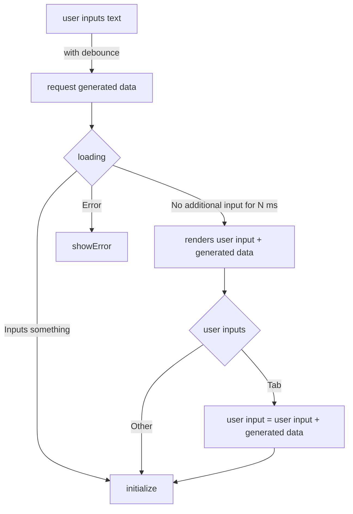

# completion-textarea

## Specs

- [ ] selection event + right click context menu
  - [ ] input: selected area text + full context
  - [ ] output: chat interface + line stretch
- [ ] virtual cursor
  - [ ] input: current position
  - [ ] output: overlay icon(opens context menu)
- [ ] recommendation
  - [ ] input: user input + custom triggers(e.g. after letter "=" OR if no additional input for 2sec)
  - [ ] output: dimmed recommendation, on custom key event(default tab keyPress) extend value and reset trigger
- [ ] line count + line focus

## Demos

- [ ] vercel AI SDK
- [ ] langchain

## P1

- [ ] implement above flow
  - [x] focus trap when tab is input
- [ ] support debounce related props
- [ ] support uncontrolled mode

## P2

- [ ] support autosize
- [ ] support custom styling
- [ ] support outer ref

## P3

- [ ] custom loading state
