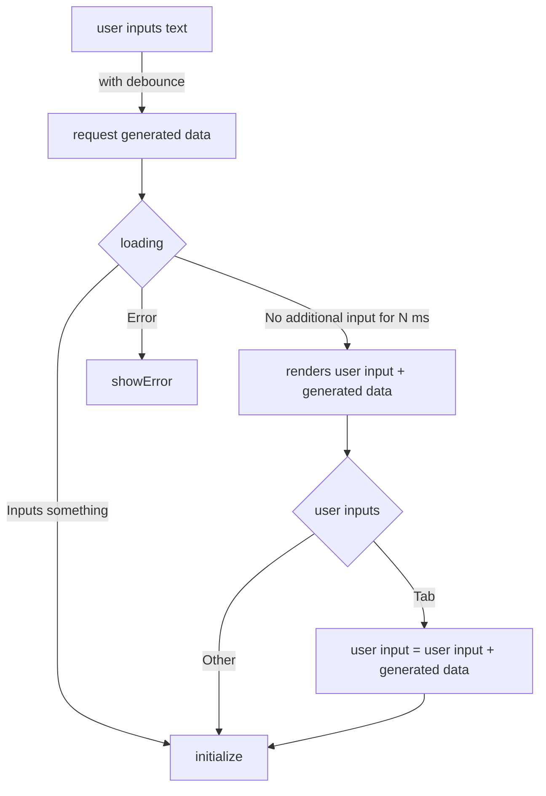

# completion-textarea

## Demos

- [ ] vercel AI SDK
- [ ] langchain

## P1

- [ ] implement above flow
  - [ ] focus trap when tab is input
- [ ] support debounce related props
- [ ] support uncontrolled mode

## P2

- [ ] support autosize
- [ ] support custom styling
- [ ] support outer ref

## P3

- [ ] custom loading state
